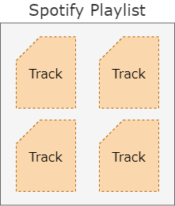
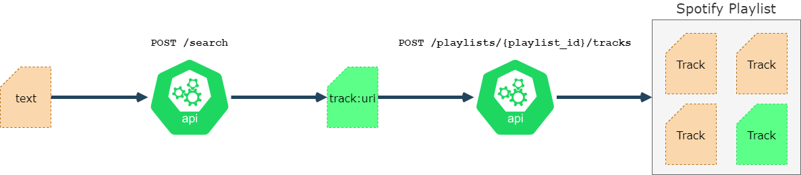

## [THE SPOTIFY PLAYLIST](https://open.spotify.com/playlist/6rag6XjWQKCEMxnWOEEVtS?si=s1aiweigRouRSVAMAXXTBA)

## The Idea

Music curation is hard to automate and still relies a lot on human input. Luckily, finding and curating music is also a passion for many people who share their work for others to enjoy.

Therefore, if we curate a list of curators that we like, we could automatically scrap their selections and put them in a single Spotify playlist.

## The Planning

Key points to keep in mind:
* Laziness is critical; everything else is secondary. Automate as much as possible.
* Music curators live on various platforms (Youtube, Reddit, Spotify itself) and new sources might appear tomorrow. Each scrapper must be independent from one another, but the output must be normalized to a single format and sent to a single location.
* Try and stay within the limits of free tiers of services/APIs used so that the whole thing costs nothing to run

## The Architecture

### Part 1: Spotify

The output of this "system" is tracks added to a Spotify playlist. When a new song appears in a playlist, we have succedeed.

Spotify's API allows us to do pretty much any operation we can do in the deskptop or mobile application. When a human wants to add a track to a playlist, it will search for it and then add the result to the playlist.

From Spotify's point of view, everything has a unique identifier (a URI): an album has a URI, a song has a URI, a playlist has a URI, a user has a URI. To add a song to a playlist, we need the playlists' URI and the track URI.

We already have the playlist URI, since that is the playlist where we want to add our songs to. To get a track URI, we could do discovery on Spotify by scavenging songs from other Spotify playlists, or we can do search and hope for a matching result. We'll do the latter for now, but we can keep in mind the former as a possible additional curation source later. 

We now have a simple but straightforward system: We have one input (text) and one output (track added to playlist). We can group all of this under one hood: `text-to-spotify-playlist-service`

### Part 2: Youtube

We are halfway to having a working prototype: we have a service that takes text as input and tries to add a song to our Spotify playlist. Now we just need a way to feed text automatically to that service.

While we want to eventually have multiple sources of songs, we'll start with a single one: Youtube. By levaraging Youtubers that upload curated songs to their channels, we can create a master list of channels to check scrap for new songs.

Our goal is to have an evolving playlist which gets continually updated, therefore we want to check these channels daily for updates.
